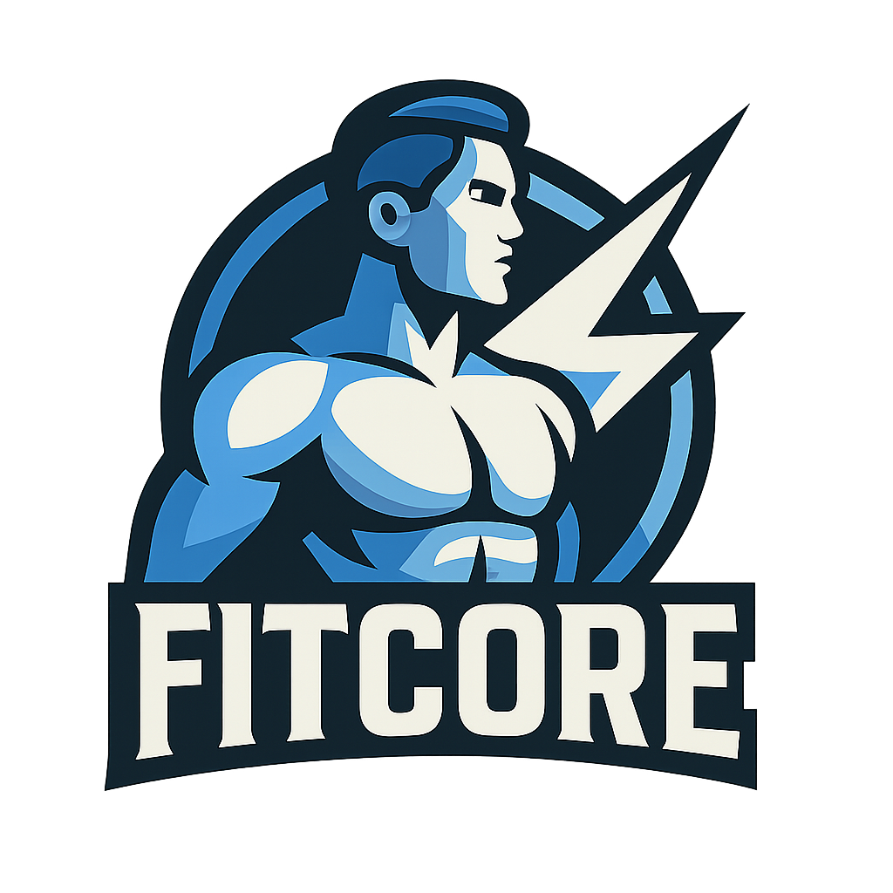

# FitCore - Aplicação Completa de Fitness e Social



FitCore é uma aplicação abrangente de tracking de fitness construída com React Native e Expo. Permite aos utilizadores rastrear treinos, construir rotinas de treino personalizadas, conectar-se com outros entusiastas do fitness, e acompanhar conquistas com funcionalidades premium avançadas.

## Funcionalidades Principais

### 🏋️ Sistema de Treinos Avançado
- **Geração Automática de Treinos Inteligente**: Sistema inteligente que cria planos de treino personalizados baseados na idade, género, objetivos, experiência e preferências
- **Construtor de Treinos Personalizado**: Interface intuitiva onde o utilizador pode criar treinos completamente personalizados
- **Sessões de Treino Detalhadas**: Tracking em tempo real de séries, repetições, pesos e tempos de descanso
- **Histórico Completo de Treinos**: Acompanhe todo o progresso ao longo do tempo
- **Previsualização de Treinos**: Veja detalhes completos antes de iniciar

### 📊 Tracking de Performance
- **Recordes Pessoais (PRs)**: Sistema completo de tracking de máximos pessoais
- **Objetivos de PRs**: Defina e acompanhe metas específicas para cada exercício
- **Detalhes de Exercícios e PRs**: Análise detalhada do progresso por exercício
- **Estatísticas Avançadas**: Gráficos e métricas de performance

### 💪 Base de Dados de Exercícios
- **Biblioteca Abrangente**: Acesso a 1000+ exercícios de múltiplas APIs
- **Filtros Inteligentes**: Pesquise por grupo muscular, equipamento, tipo de exercício
- **Anatomia Interativa**: Silhueta muscular interativa para seleção visual
- **Instruções Detalhadas**: Descrições completas e técnicas de execução

### 🤝 Funcionalidades Sociais
- **Sistema de Chat**: Mensagens diretas entre utilizadores
- **Descoberta de Utilizadores**: Encontre outros entusiastas do fitness
- **Seguir Utilizadores**: Crie conexões e acompanhe o progresso de outros
- **Partilha de Conquistas**: Celebre marcos e progressos com a comunidade

### 🏆 Sistema de Conquistas
- **Conquistas Automáticas**: Desbloqueie marcos baseados no seu progresso
- **Notificações de Conquistas**: Celebração imediata dos seus sucessos
- **Sistema de Moedas**: Ganhe recompensas por atingir objetivos

### 💎 Funcionalidades Premium
- **Subscrições e Período de Teste**: Acesso a funcionalidades avançadas
- **Geração Automática de Treinos**: Planos de treino personalizados
- **Inquérito Personalizado**: Questionário detalhado para otimizar recomendações
- **Preferências Avançadas**: Configurações detalhadas de treino

### 📅 Organização e Planeamento
- **Calendário de Treinos**: Visualize e planeie os seus treinos
- **Preferências de Treino**: Configure splits, dias por semana, objetivos específicos
- **Gestão de Subscrições**: Controlo total sobre planos premium

### 🛍️ Loja Integrada
- **Produtos de Fitness**: Acesso a equipamentos e suplementos
- **Sistema de Compras**: Interface integrada para aquisições

### ⚙️ Personalização Completa
- **Modo Escuro/Claro**: Escolha o tema preferido
- **Perfil Detalhado**: Edição completa de informações pessoais
- **Configurações Avançadas**: Personalização de preferências
- **Informações de Contacto**: Suporte direto integrado

## Stack Tecnológica

- **Frontend**: React Native 0.79.2 com Expo 53
- **Linguagem**: TypeScript para type safety
- **Gestão de Estado**: React Context API
- **Animações**: React Native Reanimated 3.17.4
- **Navegação**: Expo Router 5.0
- **Backend**: Supabase (Autenticação, Base de Dados, Storage)
- **Base de Dados**: PostgreSQL (via Supabase)
- **Estilização**: StyleSheet, Linear Gradients, SVG
- **Dados de Exercícios**: ExerciseDB (RapidAPI)
- **Gráficos**: React Native SVG Charts com D3-Shape
- **Calendários**: React Native Calendars
- **Imagens**: Expo Image com manipulação avançada
- **Comunicação**: Expo Mail Composer
- **Localização**: Expo Location
- **Feedback Háptico**: Expo Haptics
- **Áudio/Vídeo**: Expo AV

## Primeiros Passos

### Pré-requisitos

- Node.js (v16 ou superior)
- npm ou yarn
- Expo CLI
- Chave API do ExerciseDB (opcional mas recomendada)
- Conta Supabase configurada

### Instalação

1. Clone o repositório:
   ```bash
   git clone https://github.com/pedro99292/FITCORE_PAP.git
   cd fitcore
   ```

2. Instale as dependências:
   ```bash
   npm install --legacy-peer-deps
   # ou
   yarn install -legacy-peer-deps
   ```

3. Configure as variáveis de ambiente:
   - Copie `utils/apiConfig.example.ts` para `utils/apiConfig.ts`
   - Configure as suas chaves API e configurações do Supabase

4. Inicie o servidor de desenvolvimento:
   ```bash
   npm start
   # ou
   yarn start
   # ou
   npx expo start
   ```

5. Abra a aplicação em:
   - Expo Go no seu dispositivo móvel
   - Simulador iOS
   - Emulador Android

## Desenvolvimento

### Estrutura do Projeto

```
app/                          # Aplicação principal e navegação
  ├── (tabs)/                 # Ecrãs com navegação por tabs
  │   ├── home.tsx           # Ecrã principal
  │   ├── profile.tsx        # Perfil do utilizador
  │   ├── social.tsx         # Funcionalidades sociais
  │   └── achievements.tsx   # Sistema de conquistas
  ├── (auth)/                # Autenticação
  │   ├── login.tsx          # Login
  │   └── register.tsx       # Registo
  ├── chat/                  # Sistema de mensagens
  ├── workout-history/       # Histórico detalhado
  ├── workout-preview/       # Previsualização de treinos
  └── [outros ecrãs...]      # Funcionalidades adicionais

components/                   # Componentes reutilizáveis
  ├── SubscriptionModal.tsx  # Modal de subscrições
  ├── SurveyModal.tsx       # Inquérito personalizado
  ├── WorkoutGenerationModal.tsx # Geração de treinos
  ├── InteractiveMuscleSilhouette.tsx # Anatomia interativa
  └── [outros componentes...]

contexts/                    # Gestão de estado global
  ├── AuthContext.tsx        # Autenticação
  ├── SubscriptionContext.tsx # Gestão de subscrições
  ├── WorkoutContext.tsx     # Estado de treinos
  ├── ExerciseContext.tsx    # Base de dados de exercícios
  └── AchievementContext.tsx # Sistema de conquistas

utils/                       # Serviços e utilitários
  ├── workoutGenerationService.ts # IA de geração de treinos
  ├── subscriptionService.ts      # Gestão de subscrições
  ├── personalRecordsService.ts   # Tracking de PRs
  ├── achievementService.ts       # Sistema de conquistas
  ├── exerciseMatching.ts         # Matching inteligente de exercícios
  └── [outros serviços...]

constants/                   # Configurações e dados estáticos
  ├── workoutSplits.ts      # Templates de divisões de treino
  ├── workoutRules.ts       # Regras de geração de treinos
  ├── workoutTemplates.ts   # Templates pré-definidos
  └── safetyWarnings.ts     # Avisos de segurança

types/                       # Definições TypeScript
  ├── exercise.d.ts         # Tipos de exercícios
  ├── workoutGeneration.ts  # Tipos de geração de treinos
  ├── personalRecords.ts    # Tipos de recordes pessoais
  └── [outros tipos...]
```

### Funcionalidades Principais Implementadas

#### Sistema de Autenticação e Subscrições
- Autenticação completa via Supabase
- Sistema de subscrições com períodos de teste
- Gestão automática de funcionalidades premium
- Inquérito personalizado para otimização de recomendações

#### Geração Inteligente de Treinos
- Algoritmo avançado baseado em:
  - Objetivos do utilizador (hipertrofia, força, resistência, etc.)
  - Experiência (iniciante, intermédio, avançado)
  - Dados demográficos (idade, género)
  - Preferências de treino (dias por semana, divisões)
- Templates adaptativos para diferentes níveis
- Matching inteligente de exercícios da base de dados

#### Sistema Social Completo
- Chat em tempo real entre utilizadores
- Sistema de seguidores/seguindo
- Descoberta de utilizadores por interesses
- Partilha de conquistas e progresso

#### Tracking Avançado de Performance
- Recordes pessoais automáticos e manuais
- Objetivos personalizáveis por exercício
- Histórico completo preservado mesmo após alterações
- Análise detalhada de progressão

## Schema da Base de Dados

A aplicação utiliza Supabase como backend com PostgreSQL e as seguintes tabelas principais:

### **Autenticação e Utilizadores**
- `auth.users`: Sistema de autenticação do Supabase
- `users`: Perfis básicos dos utilizadores
- `users_data`: Dados detalhados do inquérito personalizado (idade, altura, peso, objetivos, experiência, etc.)

### **Sistema de Treinos**
- `workouts`: Templates e planos de treino (incluindo workout_type para distinguir auto_generated)
- `workout_sets`: Configuração de séries e repetições nos templates de treino
- `sessions`: Sessões individuais de treino executadas pelos utilizadores
- `session_sets`: Registo detalhado de cada série executada (peso real, repetições, tempo de descanso)

### **Exercícios e Performance**
- `exercises`: Base de dados completa de exercícios (1000+ exercícios)
- `personal_records`: Recordes pessoais por exercício e utilizador
- `pr_goals`: Objetivos de recordes pessoais definidos pelos utilizadores

### **Sistema Social**
- `user_followers`: Relações de seguidor/seguindo entre utilizadores
- `conversations`: Conversas entre utilizadores
- `messages`: Mensagens individuais do sistema de chat
- `post_comments`: Comentários em publicações sociais
- `post_reactions`: Reações (likes, etc.) em publicações

### **Conquistas e Subscrições**
- `user_achievements`: Conquistas desbloqueadas pelos utilizadores
- `subscriptions`: Gestão de subscrições premium e períodos de teste

### **Relações e Constraints**
- Todas as tabelas utilizam foreign keys para manter integridade referencial
- Políticas RLS (Row Level Security) implementadas para segurança de dados
- Índices otimizados para queries de performance crítica
- Triggers automáticos para limpeza de dados ao expirar subscrições

## Funcionalidades Únicas

### Geração de Treinos com IA
O sistema utiliza algoritmos avançados que consideram:
- Adaptações por idade (diferentes recomendações para seniores)
- Adaptações por género (diferentes volumes e intensidades)
- Progressão baseada na experiência
- Splits otimizados por objetivo
- Balanceamento automático de volume de treino

### Sistema de Matching de Exercícios
Algoritmo inteligente que encontra correspondências entre:
- Nomes de exercícios em diferentes formatos
- Variações e sinónimos
- Equipamentos equivalentes
- Grupos musculares similares

### Gestão Inteligente de Dados
- Preservação de histórico mesmo após exclusões
- Limpeza automática de dados premium expirados
- Otimização de performance com caching
- Sincronização offline/online

## Contribuir

1. Faça fork do repositório
2. Crie o seu branch de funcionalidade (`git checkout -b feature/funcionalidade-incrivel`)
3. Commit as suas alterações (`git commit -m 'Adiciona funcionalidade incrível'`)
4. Push para o branch (`git push origin feature/funcionalidade-incrivel`)
5. Abra um Pull Request

## Licença

Este projeto está licenciado sob a Licença MIT - consulte o ficheiro LICENSE para detalhes.

## Agradecimentos

- [Expo](https://expo.dev) - Plataforma de desenvolvimento
- [React Native](https://reactnative.dev) - Framework móvel
- [Supabase](https://supabase.io) - Backend como serviço
- [ExerciseDB](https://rapidapi.com/justin-WFnsXH_t6/api/exercisedb) - Base de dados de exercícios

## Suporte

Para suporte, utilize a funcionalidade "Contactar-nos" integrada na aplicação ou abra uma issue no repositório.

---

**Desenvolvido com esforço para a comunidade fitness**
